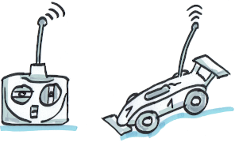

# Introduction to Arduino boards
Teaching at Hamburg University of Applied Sciences (HAW Hamburg), I love to use Arduino boards with my students in the degree programs on electrical and information engineering. Arduino boards are quite cheap and easy to program, even for first-semester students. And it is easy to extend them by all sorts of sensors and actors, making them a perfect choice to apply all the theory covered in the lectures and create all sorts of systems (e. g., robotics) with only moderate effort. In the end, I want my students to have fun _doing_ things and apply, not learn books by heart. I am convinced that this will help them become good engineers.

In this context, I have elaborated materials (slides and sample programs) to help my students learn quickly how to work with Arduinos. Maybe you find this material helpful as well.

## Fundamentals

The slide set _Fundamentals_ is intended to make you familiar with the commonly used boards such as UNO, Nano, and Mega. Apart from the Arduino board, only few low-cost parts are required (like breadboard, cables, LEDs, resistors, push button.) Also, an introduction how to use the "standard" ultrasonic distance sensor HC-SR04 is given. This cheap sensor, alone, can be a lot of fun already.

1. _Arduino board and IDE_ (Fundamental pins and interfaces, required software, basic program)
1. _Basic digital output_ (Create digital output signals, make LEDs blink in specific patterns)
1. _Digital output using PWM_ (Control the power of digital output pins, dim LEDs using PWM pins)
1. _Reading digital input_ (Read digital input pins, react to buttons, print to the IDE, generate random numbers, measure elapsed time and pulse lengths)
1. _Interrupts on digital input changes_ (React on voltage changes of digital pins, define interrupt handling)
1. _Measuring analog input_ (Measure voltages at analog pins)

## RC-controlled cars

As many student projects use RC model cars, there is an introduction how to control RC cars by Arduino boards. I want to rework the material before uploading it, though. Please be patient. Topics covered include:

1. Receiver channels, signals, and principle components of a RC car
1. Control steering and throttle directly by Arduino-generated signals
1. Control steering and throttle by a servo / PWM driver board
1. Combine manual driving (i. e., with standard remote control) and Arduino control (e. g., assistance system)
1. Control via a bluetooth module (e. g., by an Android app)

## Upload status (uploaded or still to come)
- [X] Fundamentals ([PDF](docs/), [source codes](src/fundamentals))
- [ ] Controlling RC cars (PDF, source codes)
- [ ] Further topics

## Contact
Marc Hensel, University of Applied Sciences Hamburg (HAW Hamburg)

http://www.haw-hamburg.de/marc-hensel
